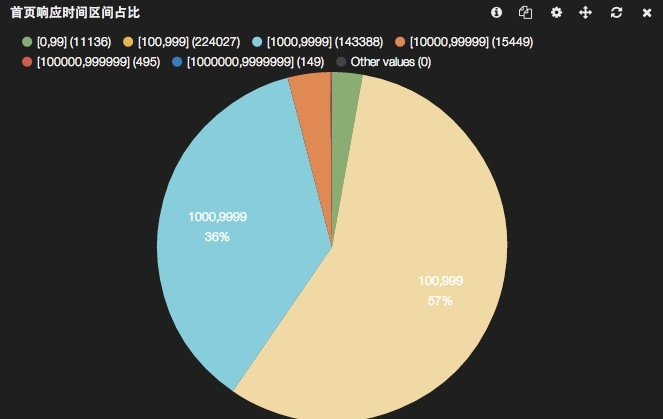
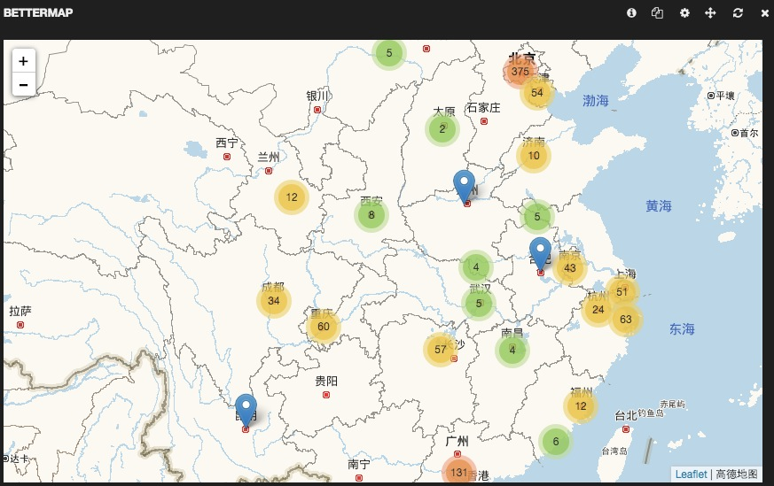
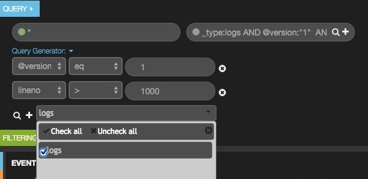
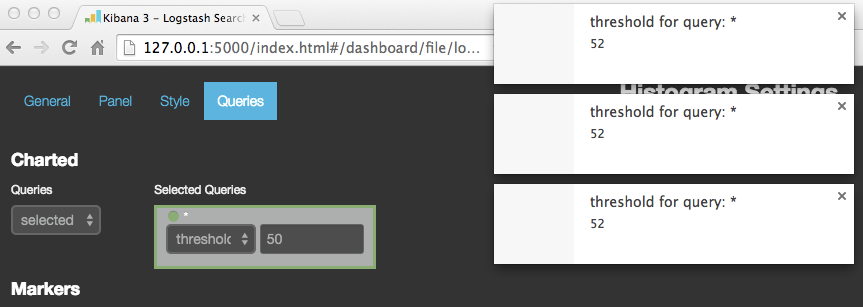
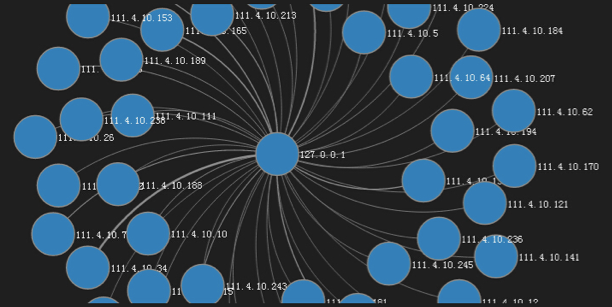

chenryn's changelog
================

## Auth WebUI in Mojolicious

There is alreadys kibana-auth repos wrote in NodeJs or RubyOnRails. However I don't familar with both those but can only write a little Perl5 code. So, I use [Mojolicious](http://mojolicio.us) web framework to do this.

I place all my auth code at `kbnauth` sub directory, if you don't want any auth, just use the original `src` directory.(In facts, I use symlinks for my `kbnauth/public/*`)

### features

* full async proxy

You can control every requests sending to elasticsearch. I use `config.js.ep` for `elasticsearch` setting, and return a **fake** `/_nodes` response body which only has one node point to the webserver.

*Note: Mojolicious set default `max_message_size` to 10MB, I change this setting to 0 which means indefinite size in `script/kbnauth`. You can change this to any threshold value you want.*

**2014.11.04: Now all requests send to ES asynchronously. It's a big improve for performance.**

* using a elasticsearch `kibana-auth` index for authorization

Since all the requests would send to the proxy server, every user would has his own namespace for dashboards(`kibana-int-$username`, yes, it's a common implement that kibana-proxy used. You can run `./script/kbnauth migratint username hisdashname...` for quick migration) and can only access his own indices or even cluster.

**2014.11.04: use Mojo::Cache to cache `kibana-auth/indices/$user` result. It's a big improve for performance.**

You can add `kibana-auth` for user "sri" as follow:

```
$ curl -XPOST http://127.0.0.1:9200/kibana-auth/indices/sri -d '{
  "prefix":["logstash-sri","logstash-ops"],
  "route" :"/dashboard/elasticsearch/sri-dash",
  "server":"192.168.0.2:9200"
}'
```

Or (for windows user, you can use Strawberry Perl to do this directly)

```perl
perl -MHTTP::Tiny -MJSON -E 'say to_json(HTTP::Tiny->new->post("http://10.13.57.35:9200/kibana-auth/indices/sri", {content=>to_json({prefix=>["logstash-sri","logstash-ops"],route=>"/dashboard/elasticsearch/sri-dash",server=>"192.168.0.2:9200"})}))'
```

Then "sri" can access the "logstash-sri-YYYY.mm.dd" and "logstash-ops-YYYY.mm.dd" indices stored on "192.168.0.2:9200". And he would see `/dashboard/elasticsearch/sri-dash` dashboard as homepage.

* using [Authen::Simple](https://metacpan.org/pod/Authen::Simple) framework for authentication

Authen::Simple is a great framework that support so many authentication methods. For example: LDAP, DBI, SSH, Kerberos, PAM, SMB, NIS, PAM, ActiveDirectory etc.

I use Passwd as default(using `htpasswd` commandline). But you can add/change more methods to `kbn_auth.conf` as follow:

```perl
  authen => {
    LDAP => {
      host   => 'ad.company.com',
      binddn => 'proxyuser@company.com',
      bindpw => 'secret',
      basedn => 'cn=users,dc=company,dc=com',
      filter => '(&(objectClass=organizationalPerson)(objectClass=user)(sAMAccountName=%s))'
    },
  }
```

### Install(bundle way)

I used `carton` to bundle the whole dependent libraries into `vendor/cache`. So you can install and run kbnauth as follow:

```
cd kbnauth
./vendor/bin/carton install --cached
./vendor/bin/carton exec local/bin/hypnotoad script/kbnauth
```

### Install(manual way)

The code depands on Mojolicious and Authen::Simple.

```
cd kbnauth
curl -L http://xrl.us/cpanm -o /usr/local/bin/cpanm
chmod +x /usr/local/bin/cpanm
cpanm Mojolicious Authen::Simple::Passwd
morbo script/kbnauth # listen :3000 for development
hypnotoad script/kbnauth     # listen :80 for production, ports defined at kbn_auth.conf
```

*For windows user, install [Strawpberry Perl](http://strawberryperl.com/) which bring `cpanm` already.*

**If you want use other authen methods, for example, LDAP, just run `cpanm Authen::Simple::LDAP`.**

*Tips: if you run the code at a clean RHEL system, you may find `Digest::SHA` need to install too. RedHat split Perl core modules to a special `perl-core` RPM. Run `yum install -y perl-core` to solve it. I HATE REDHAT!*

Now you can login with init user/pass: "sri/secr3t". (this is the name of mojolicious creator)

## percentile panel

Percentile is a great data analysis method. Elasticsearch add percentile aggregation support after version 1.1.0. ~~But Kibana v3 use an outdate elastic.js which don't support aggergation! So I write this panel using native angularjs `$.http` api.~~ Merged new version of elasticjs at 2014/08/15, rewrite this panel now.(DONE at 2014/08/16)

Add compression options to control PercentileAggregation, because percentile may be so slow. Saw <http://www.elasticsearch.org/guide/en/elasticsearch/reference/current/search-aggregations-metrics-percentile-aggregation.html#search-aggregations-metrics-percentile-aggregation-compression> for the reason.

## range panel

I need a pie chart to show percentile of range sections(percentile rank wait for only one value). So I use RangeFacet to implement this.

Here is the rendering:



And you can add more range sections as you like:


## export table panel as CSV

Port kibana 4 exportAsCsv function back to kibana 3.

Note that I add the export icon in panelModal, so you may need add a `"exportable":true` into your exists dashboard json by hands, overwise it won't trigger the `ng-show`.

## uniq mode for histogram panel

First, I re-implement histogram panel using the new aggregations api instead of facets api. The requst now is a nested aggregation with global/filter/date_histogram in turns. Then we can set stats aggregation as a sub aggr for "min/max/avg", and also cardinality aggregation for "uniq"! What ever you want could be added in the same way. Much thanks for aggr.

**Attention: the cardinality aggregation was added in elasticsearch 1.1.0.**

Offical blog about cardinality aggr: <http://www.elasticsearch.org/blog/count-elasticsearch/>

## bettermap providers

Now you can select different leaflet map providers from `bettermap` panel settings.

For chinese user, there is **GaoDe**(高德地图)!



## queries generator

Fetch `_type` and `fields` from `/_mapping` API. and help you to generate some querystrings by click multi-select.



## histogram threshold notification

Use [HTML5 Notification API](https://developer.mozilla.org/en-US/docs/Web/API/notification) to alert the outier value of queries.



## china map

Use map.cn.js from <http://jvectormap.com/maps/countries/china/>, delete `CN-` because `filter/geoip` don't have such prefix.

Add Taiwan to this map.

Many thanks to this author(@loveshell)!

## term_stats map

Provide a way to choose the stat to display into the map, not only the total number of hits but also min/max/total etc.

Many thanks to this author(@eMerzh)!

<https://github.com/elasticsearch/kibana/pull/1270>

## statisticstrend panel

This panel is so useful if you want to check the trend of your statistic history.


Many thanks to this author(@opsSysDev)!

## multifieldhistogram panel

Enable histogram panel to plot multiple fields.


Many thanks to this author(@tvvmb)!

<https://github.com/elasticsearch/kibana/pull/1296>

## multiple Y-Axis for multifieldhistogram panel

You can select one field to use right Y-Axis to show your data.

## valuehistogram panel

Enhances the histogram panel to support value-based histograms in addition to time-series histograms.


Many thanks to this author(@jdve)!

<https://github.com/elasticsearch/kibana/pull/622>

## panel refresh

Adds refresh icon to kibana panel directive which broadcasts a refresh event down its scope chain.

Many thanks to this author(@thegreenpizza)!

<https://github.com/elasticsearch/kibana/pull/1423>

## Upgraded angular, elasticsearchjs and elasticjs

* Angular is now at 1.2.20
* Elasticsearch JS now included
* Updated to the latest elasticjs

<https://github.com/elasticsearch/kibana/pull/1377>

Add two configuration settings into `config.js`:

1. sniff: now kibana would sniff all your nodes by default
2. request_timeout: now kibana wouldn't render panels if your data return after 30 seconds

*If you had wrote your own panels and want to migrate to the latest elasticjs, just change a few codes as follow:*

```javascript
request = $scope.ejs.Request();
results = $scope.ejs.doSearch(dashboard.indices, request);
$scope.inspector = request.toJSON();
```

## force panel

Add force panel of packetbeat.



<https://github.com/packetbeat/kibana/commit/27cba54a73dd4246161df1bb1ed45d380588c6a5>

## hiddenable navbar

Add `ng-show="dashboard.current.nav.length"` into `index.html`. So now you can use dynamic script dashboard to show only panel without any other things. This is very useful if you want embed some panel chart into other systems.

See script dashboard at : <./src/app/dashboards/panel.js>

## scriptField for terms panel

Support to define scripted field for terms/termstats facet. Just like what you can do in Kibana4.


TODO
=======================

* ~~Math.log() for valuehistogram panel~~ (had try `_.map(series, function(v){return Math.log(v)})`, not so useful)
* percentile histogram panel <http://www.flotcharts.org/flot/examples/percentiles/index.html>??
* heatmap panel <http://www.patrick-wied.at/static/heatmapjs/plugin-leaflet-layer.html>
* ~~threshold for histogram <http://www.flotcharts.org/flot/examples/threshold/index.html>~~ (had try, not so useful, but I keep this commit in the repo)
* ~~webkit.notification for histogram~~
* ~~script fields for terms panel~~
* Multiple axis support for multifieldhistogram
